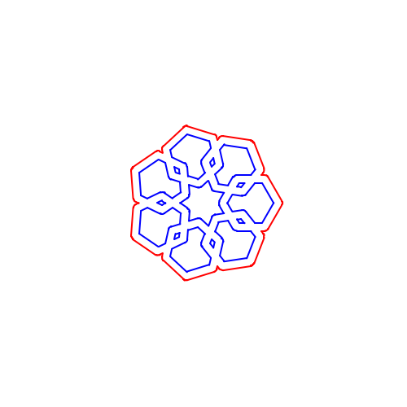
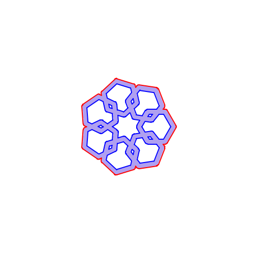

# polymark - render shapes and text as polygons

## Overview

For line graphics and plotters/lasers/cnc devices, it is convenient to
be able to render shapes as outlines. This package converts desired
shapes into such outlines in the form of
[`polygon.Shapes`](https://zappem.net/pub/math/polygon).

## Example

The package contains an `examples/lines.go` program to demonstrate the
capabilities of the `polymark` package. For example,

```
$ go run examples/lines.go --n=3 --wide=10 --m=5 --width 400 --height 400
2025/06/15 09:58:50 wrote result to "image.png"
```

generates a 400x400 pixel image:


The default options for `example/lines.go` generate the following
500x500 pixel image:



```
$ go run examples/lines.go 
2025/06/20 08:35:12 wrote result to "image.png"
```

The default options for `example/lines.go` with the `--fill` argument,
generates the following 500x500 pixel image:



```
$ go run examples/lines.go --fill
2025/06/20 08:35:12 wrote result to "image.png"
```

Use `go run examples/lines.go --help` to see all of the flag options.

## Tests

The package contains a simple set of tests that can be run as follows:

```
$ git clone https://github.com/tinkerator/polymark.git
$ cd polymark
$ go test -v
=== RUN   TestCircle
--- PASS: TestCircle (0.00s)
=== RUN   TestLine
    polymark_test.go:121: [ 0]  got="..##################################..."
    polymark_test.go:121: [ 1]  got=".##................................##.."
    polymark_test.go:121: [ 2]  got="##..................................##."
    polymark_test.go:121: [ 3]  got="#....................................#."
    polymark_test.go:121: [ 4]  got="#....................................#."
    polymark_test.go:121: [ 5]  got="##..................................##."
    polymark_test.go:121: [ 6]  got=".##................................##.."
    polymark_test.go:121: [ 7]  got="..##################################..."
    polymark_test.go:121: [ 8]  got="......................................."
--- PASS: TestLine (0.00s)
=== RUN   TestText
    polymark_test.go:159: [ 0]  got="....#####....."
    polymark_test.go:159: [ 1]  got="...#.#######.."
    polymark_test.go:159: [ 2]  got="..###.....###."
    polymark_test.go:159: [ 3]  got=".##........#.#"
    polymark_test.go:159: [ 4]  got=".##.........##"
    polymark_test.go:159: [ 5]  got="##..........##"
    polymark_test.go:159: [ 6]  got="##############"
    polymark_test.go:159: [ 7]  got="##############"
    polymark_test.go:159: [ 8]  got="##............"
    polymark_test.go:159: [ 9]  got="##............"
    polymark_test.go:159: [10]  got=".##..........."
    polymark_test.go:159: [11]  got=".##.........##"
    polymark_test.go:159: [12]  got=".#.#.......#.#"
    polymark_test.go:159: [13]  got="..##.....####."
    polymark_test.go:159: [14]  got="...######.#..."
    polymark_test.go:159: [15]  got=".....#####...."
    polymark_test.go:186: [ 0]  got="..#####.."
    polymark_test.go:186: [ 1]  got=".##..#.#."
    polymark_test.go:186: [ 2]  got=".#.#..##."
    polymark_test.go:186: [ 3]  got="#...#..#."
    polymark_test.go:186: [ 4]  got="#....###."
    polymark_test.go:186: [ 5]  got="##....#.."
    polymark_test.go:186: [ 6]  got="#.#......"
    polymark_test.go:186: [ 7]  got=".####...."
    polymark_test.go:186: [ 8]  got="........."
    polymark_test.go:224: [ 0]  got="##............"
    polymark_test.go:224: [ 1]  got="##............"
    polymark_test.go:224: [ 2]  got="##............"
    polymark_test.go:224: [ 3]  got="##............"
    polymark_test.go:224: [ 4]  got="##............"
    polymark_test.go:224: [ 5]  got="##............"
    polymark_test.go:224: [ 6]  got="##............"
    polymark_test.go:224: [ 7]  got="##.######....."
    polymark_test.go:224: [ 8]  got="###########..."
    polymark_test.go:224: [ 9]  got="####.....###.."
    polymark_test.go:224: [10]  got="###.......###."
    polymark_test.go:224: [11]  got="##.........##."
    polymark_test.go:224: [12]  got="##..........##"
    polymark_test.go:224: [13]  got="##..........##"
    polymark_test.go:224: [14]  got="##..........##"
    polymark_test.go:224: [15]  got="##..........##"
    polymark_test.go:224: [16]  got="##..........##"
    polymark_test.go:224: [17]  got="##.........##."
    polymark_test.go:224: [18]  got="##.........##."
    polymark_test.go:224: [19]  got="###.......###."
    polymark_test.go:224: [20]  got="####....####.."
    polymark_test.go:224: [21]  got="###########..."
    polymark_test.go:224: [22]  got="##..#####....."
--- PASS: TestText (0.00s)
=== RUN   TestAlign
    polymark_test.go:264:   0> ".###############....#........................###############........#######....................###############....###########....."
    polymark_test.go:264:   1> "........#...........#...............................#..............##.....##..........................#...........#..........##..."
    polymark_test.go:264:   2> "........#...........#...............................#.............#.........#.........................#...........#............#.."
    polymark_test.go:264:   3> "........#...........#...............................#............#...........#........................#...........#............##."
    polymark_test.go:264:   4> "........#...........#...............................#...........##...........##.......................#...........#.............#."
    polymark_test.go:264:   5> "........#...........#...............................#...........#.............#.......................#...........#.............#."
    polymark_test.go:264:   6> "........#...........#...............................#...........#.....................................#...........#.............#."
    polymark_test.go:264:   7> "........#...........#...............................#..........#......................................#...........#............##."
    polymark_test.go:264:   8> "........#...........#...............................#..........#......................................#...........#............#.."
    polymark_test.go:264:   9> "........#...........#...............................#..........#......................................#...........#..........##..."
    polymark_test.go:264:  10> "........#...........#...............................#..........#......................................#...........###########....."
    polymark_test.go:264:  11> "........#...........#...............................#..........#......................................#...........#.......#......."
    polymark_test.go:264:  12> "........#...........#...............................#..........#......................................#...........#.......#......."
    polymark_test.go:264:  13> "........#...........#...............................#..........#......................................#...........#........#......"
    polymark_test.go:264:  14> "........#...........#...............................#..........#......................................#...........#.........#....."
    polymark_test.go:264:  15> "........#...........#...............................#...........#.....................................#...........#.........#....."
    polymark_test.go:264:  16> "........#...........#...............................#...........#.............#.......................#...........#..........#...."
    polymark_test.go:264:  17> "........#...........#...............................#...........##...........##.......................#...........#..........#...."
    polymark_test.go:264:  18> "........#...........#...............................#............#...........#........................#...........#...........#..."
    polymark_test.go:264:  19> "........#...........#...............................#.............#.........#.........................#...........#............#.."
    polymark_test.go:264:  20> "........#...........#...............................#..............##.....##..........................#...........#............#.."
    polymark_test.go:264:  21> "........#...........#############...................#...............#######...........................#...........#.............#."
    polymark_test.go:264:  22> ".................................................................................................................................."
    polymark_test.go:264:  23> ".................................................................................................................................."
    polymark_test.go:264:  24> ".................................................................................................................................."
    polymark_test.go:264:  25> "#...............#.......#................#...............#...........#######..............#...............#.......###########....."
    polymark_test.go:264:  26> "#...............#.......#................#...............#..........##.....##.............#...............#.......#..........##..."
    polymark_test.go:264:  27> "##.............##.......#................##.............##.........#.........#............##.............##.......#............#.."
    polymark_test.go:264:  28> "##.............##.......#................##.............##........#...........#...........##.............##.......#............##."
    polymark_test.go:264:  29> "#.#...........#.#.......#................#.#...........#.#.......##...........##..........#.#...........#.#.......#.............#."
    polymark_test.go:264:  30> "#.#...........#.#.......#................#.#...........#.#.......#.............#..........#.#...........#.#.......#.............#."
    polymark_test.go:264:  31> "#.#...........#.#.......#................#.#...........#.#.......#........................#.#...........#.#.......#.............#."
    polymark_test.go:264:  32> "#..#.........#..#.......#................#..#.........#..#......#.........................#..#.........#..#.......#............##."
    polymark_test.go:264:  33> "#..#.........#..#.......#................#..#.........#..#......#.........................#..#.........#..#.......#............#.."
    polymark_test.go:264:  34> "#..#.........#..#.......#................#..#.........#..#......#.........................#..#.........#..#.......#..........##..."
    polymark_test.go:264:  35> "#...#.......#...#.......#................#...#.......#...#......#.........................#...#.......#...#.......###########....."
    polymark_test.go:264:  36> "#...#.......#...#.......#................#...#.......#...#......#.........................#...#.......#...#.......#.......#......."
    polymark_test.go:264:  37> "#....#.....#....#.......#................#....#.....#....#......#.........................#....#.....#....#.......#.......#......."
    polymark_test.go:264:  38> "#....#.....#....#.......#................#....#.....#....#......#.........................#....#.....#....#.......#........#......"
    polymark_test.go:264:  39> "#....#.....#....#.......#................#....#.....#....#......#.........................#....#.....#....#.......#.........#....."
    polymark_test.go:264:  40> "#.....#...#.....#.......#................#.....#...#.....#.......#........................#.....#...#.....#.......#.........#....."
    polymark_test.go:264:  41> "#.....#...#.....#.......#................#.....#...#.....#.......#.............#..........#.....#...#.....#.......#..........#...."
    polymark_test.go:264:  42> "#.....#...#.....#.......#................#.....#...#.....#.......##...........##..........#.....#...#.....#.......#..........#...."
    polymark_test.go:264:  43> "#......#.#......#.......#................#......#.#......#........#...........#...........#......#.#......#.......#...........#..."
    polymark_test.go:264:  44> "#......#.#......#.......#................#......#.#......#.........#.........#............#......#.#......#.......#............#.."
    polymark_test.go:264:  45> "#.......#.......#.......#................#.......#.......#..........##.....##.............#.......#.......#.......#............#.."
    polymark_test.go:264:  46> "#.......#.......#.......#############....#.......#.......#...........#######..............#.......#.......#.......#.............#."
    polymark_test.go:264:  47> ".................................................................................................................................."
    polymark_test.go:264:  48> ".................................................................................................................................."
    polymark_test.go:264:  49> ".................................................................................................................................."
    polymark_test.go:264:  50> ".................................................................................................................................."
    polymark_test.go:264:  51> ".................................................................................................................................."
    polymark_test.go:264:  52> ".................................................................................................................................."
    polymark_test.go:264:  53> ".###########..........#.....................###########..............#######.................###########..........###########....."
    polymark_test.go:264:  54> ".#..........##........#.....................#..........##...........##.....##................#..........##........#..........##..."
    polymark_test.go:264:  55> ".#............#.......#.....................#............#.........#.........#...............#............#.......#............#.."
    polymark_test.go:264:  56> ".#............##......#.....................#............##.......#...........#..............#............##......#............##."
    polymark_test.go:264:  57> ".#.............#......#.....................#.............#......##...........##.............#.............#......#.............#."
    polymark_test.go:264:  58> ".#.............#......#.....................#.............#......#.............#.............#.............#......#.............#."
    polymark_test.go:264:  59> ".#.............#......#.....................#.............#......#...........................#.............#......#.............#."
    polymark_test.go:264:  60> ".#............##......#.....................#............##.....#............................#............##......#............##."
    polymark_test.go:264:  61> ".#............#.......#.....................#............#......#............................#............#.......#............#.."
    polymark_test.go:264:  62> ".#..........##........#.....................#..........##.......#............................#..........##........#..........##..."
    polymark_test.go:264:  63> ".###########..........#.....................###########.........#............................###########..........###########....."
    polymark_test.go:264:  64> ".#..........##........#.....................#..........##.......#............................#..........##........#.......#......."
    polymark_test.go:264:  65> ".#............#.......#.....................#............#......#............................#............#.......#.......#......."
    polymark_test.go:264:  66> ".#............##......#.....................#............##.....#............................#............##......#........#......"
    polymark_test.go:264:  67> ".#.............#......#.....................#.............#.....#............................#.............#......#.........#....."
    polymark_test.go:264:  68> ".#.............#......#.....................#.............#......#...........................#.............#......#.........#....."
    polymark_test.go:264:  69> ".#.............#......#.....................#.............#......#.............#.............#.............#......#..........#...."
    polymark_test.go:264:  70> ".#.............#......#.....................#.............#......##...........##.............#.............#......#..........#...."
    polymark_test.go:264:  71> ".#............##......#.....................#............##.......#...........#..............#............##......#...........#..."
    polymark_test.go:264:  72> ".#............#.......#.....................#............#.........#.........#...............#............#.......#............#.."
    polymark_test.go:264:  73> ".#..........##........#.....................#..........##...........##.....##................#..........##........#............#.."
    polymark_test.go:264:  74> ".###########..........#############.........###########..............#######.................###########..........#.............#."
    polymark_test.go:264:  75> ".................................................................................................................................."
--- PASS: TestAlign (0.00s)
PASS
ok      zappem.net/pub/graphics/polymark        0.009s
```

## Reporting bugs

The `polymark` package has been developed purely out of self-interest
and offers no guarantee of fixes or support. That being said, if you
would like to suggest a feature addition or suggest a fix, please use
the [bug tracker](https://github.com/tinkerator/polymark/issues).

## License information

See the [LICENSE](LICENSE) file: the same BSD 3-clause license as that
used by [golang](https://golang.org/LICENSE) itself.
