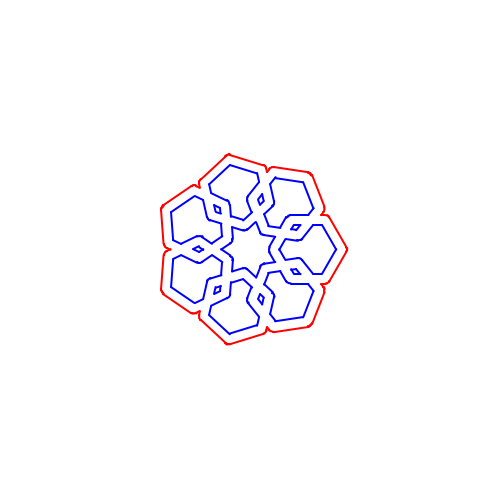
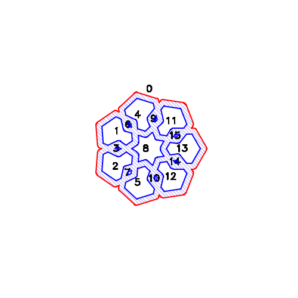
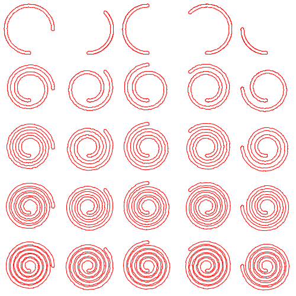

# polymark - render shapes and text as polygons

## Overview

For line graphics and plotters/lasers/cnc devices, it is convenient to
be able to render shapes as outlines. This
[package](https://zappem.net/pub/graphics/polymark/) converts desired
shapes into such outlines in the form of
[`polygon.Shapes`](https://zappem.net/pub/math/polygon).

## Example

The package contains an `examples/lines.go` program to demonstrate the
capabilities of the `polymark` package. For example,

```
$ go run examples/lines.go --n=3 --wide=10 --m=5 --width 400 --height 400
2025/06/15 09:58:50 wrote result to "image.png"
```

generates a 400x400 pixel image:


The default options for `example/lines.go`:

```
$ go run examples/lines.go 
2025/06/20 08:35:12 wrote result to "image.png"
```

generates the following 500x500 pixel image:



With `--ids`, `--fill`, `--angle` and `--hatch` arguments:

```
$ go run examples/lines.go --ids --fill --hatch 4 --angle 45
2026/04/28 06:59:06 wrote result to "image.png"
```

generates the following 500x500 pixel image with the solid parts of
the shapes hatched at an angle of 45 degrees and each polygon of
outline is numerically identified:



Use `go run examples/lines.go --help` to see all of the flag options.

Another example demonstrates use of the `pen.Spiral()` function. This
can output both PNG and also `polygon.Shape` output. For the former:

```
$ go run examples/spirals.go --png spirals.png
```

generates this image:



If you generate the `polygon.Shapes` JSON output, you can convert that
to an SVG with the
[`svgpoly`](https://zappem.net/pub/graphics/svgpoly/)
`examples/outlines.go` example:

```
$ go run examples/spiral.go --poly /tmp/spirals.json
$ cd /tmp
$ git clone https://github.com/tinkerator/svgpoly
$ cd svgpoly
$ go run examples/outline.go --poly /tmp/spirals.json --osvg spirals.svg --hatch 2
```

which generates this image:


## Tests

The package contains a simple set of tests that can be run as follows:

```
$ git clone https://github.com/tinkerator/polymark.git
$ cd polymark
$ go test -v
=== RUN   TestCircle
--- PASS: TestCircle (0.00s)
=== RUN   TestLine
    polymark_test.go:122: [ 0]  got="..##################################..."
    polymark_test.go:122: [ 1]  got=".##................................##.."
    polymark_test.go:122: [ 2]  got="##..................................##."
    polymark_test.go:122: [ 3]  got="#....................................#."
    polymark_test.go:122: [ 4]  got="#....................................#."
    polymark_test.go:122: [ 5]  got="##..................................##."
    polymark_test.go:122: [ 6]  got=".##................................##.."
    polymark_test.go:122: [ 7]  got="..##################################..."
    polymark_test.go:122: [ 8]  got="......................................."
--- PASS: TestLine (0.00s)
=== RUN   TestText
    polymark_test.go:161: [ 0]  got="....######....."
    polymark_test.go:161: [ 1]  got="...#..######..."
    polymark_test.go:161: [ 2]  got="..#.##....#.#.."
    polymark_test.go:161: [ 3]  got=".#.#.......#.#."
    polymark_test.go:161: [ 4]  got=".##........#.#."
    polymark_test.go:161: [ 5]  got="##..........##."
    polymark_test.go:161: [ 6]  got="##############."
    polymark_test.go:161: [ 7]  got="##############."
    polymark_test.go:161: [ 8]  got="##............."
    polymark_test.go:161: [ 9]  got="##............."
    polymark_test.go:161: [10]  got="#.#............"
    polymark_test.go:161: [11]  got=".##.........##."
    polymark_test.go:161: [12]  got=".#.#.......#.#."
    polymark_test.go:161: [13]  got="..#.#....##.#.."
    polymark_test.go:161: [14]  got="...######..#..."
    polymark_test.go:161: [15]  got=".....######...."
    polymark_test.go:161: [16]  got="..............."
    polymark_test.go:188: [ 0]  got="...####.."
    polymark_test.go:188: [ 1]  got=".#####.#."
    polymark_test.go:188: [ 2]  got=".#.#..##."
    polymark_test.go:188: [ 3]  got="##..#..#."
    polymark_test.go:188: [ 4]  got="##...###."
    polymark_test.go:188: [ 5]  got="##....##."
    polymark_test.go:188: [ 6]  got="#.#......"
    polymark_test.go:188: [ 7]  got=".####...."
    polymark_test.go:188: [ 8]  got="........."
    polymark_test.go:227: [ 0]  got="##............."
    polymark_test.go:227: [ 1]  got="##............."
    polymark_test.go:227: [ 2]  got="##............."
    polymark_test.go:227: [ 3]  got="##............."
    polymark_test.go:227: [ 4]  got="##............."
    polymark_test.go:227: [ 5]  got="##............."
    polymark_test.go:227: [ 6]  got="##............."
    polymark_test.go:227: [ 7]  got="##.######......"
    polymark_test.go:227: [ 8]  got="###########...."
    polymark_test.go:227: [ 9]  got="#####....###..."
    polymark_test.go:227: [10]  got="###.......###.."
    polymark_test.go:227: [11]  got="##.........##.."
    polymark_test.go:227: [12]  got="##.........#.#."
    polymark_test.go:227: [13]  got="##..........##."
    polymark_test.go:227: [14]  got="##..........##."
    polymark_test.go:227: [15]  got="##..........##."
    polymark_test.go:227: [16]  got="##..........##."
    polymark_test.go:227: [17]  got="##.........#.#."
    polymark_test.go:227: [18]  got="##.........##.."
    polymark_test.go:227: [19]  got="###.......###.."
    polymark_test.go:227: [20]  got="####....####..."
    polymark_test.go:227: [21]  got="###########...."
    polymark_test.go:227: [22]  got="##..######....."
    polymark_test.go:227: [23]  got="..............."
--- PASS: TestText (0.01s)
=== RUN   TestAlign
    polymark_test.go:267:   0> ".################...##.......................###############........######.....................################...###########....."
    polymark_test.go:267:   1> ".###############....##.......................###############.......#.#######...................###############....##############.."
    polymark_test.go:267:   2> "........##..........##..............................#.............###......##.........................##..........##.........####."
    polymark_test.go:267:   3> "........##..........##..............................#............#...........#........................##..........##...........#.#"
    polymark_test.go:267:   4> "........##..........##..............................#...........##...........##.......................##..........##............##"
    polymark_test.go:267:   5> "........##..........##..............................#...........#.............#.......................##..........##............##"
    polymark_test.go:267:   6> "........##..........##..............................#...........#.............#.......................##..........##............##"
    polymark_test.go:267:   7> "........##..........##..............................#..........#......................................##..........##............#."
    polymark_test.go:267:   8> "........##..........##..............................#..........#......................................##..........##...........##."
    polymark_test.go:267:   9> "........##..........##..............................#..........#......................................##..........##.........###.."
    polymark_test.go:267:  10> "........##..........##..............................#..........#......................................##..........#############..."
    polymark_test.go:267:  11> "........##..........##..............................#..........#......................................##..........###########....."
    polymark_test.go:267:  12> "........##..........##..............................#..........#......................................##..........##......#......."
    polymark_test.go:267:  13> "........##..........##..............................#..........#......................................##..........##.......#......"
    polymark_test.go:267:  14> "........##..........##..............................#..........#......................................##..........##........#....."
    polymark_test.go:267:  15> "........##..........##..............................#...........#.....................................##..........##........#....."
    polymark_test.go:267:  16> "........##..........##..............................#...........#.............#.......................##..........##.........#...."
    polymark_test.go:267:  17> "........##..........##..............................#...........##...........##.......................##..........##.........#...."
    polymark_test.go:267:  18> "........##..........##..............................#............#...........#........................##..........##..........#..."
    polymark_test.go:267:  19> "........##..........##..............................#............##.........##........................##..........##...........#.."
    polymark_test.go:267:  20> "........##..........##..............................#..............#......##..........................##..........##...........#.."
    polymark_test.go:267:  21> "........##..........##############..................#..............#######.#..........................##..........##............##"
    polymark_test.go:267:  22> "........#...........#############...................#................######...........................#...........#.............#."
    polymark_test.go:267:  23> ".................................................................................................................................."
    polymark_test.go:267:  24> ".................................................................................................................................."
    polymark_test.go:267:  25> "##..............##......##...............##..............##..........#######..............##..............##......###########....."
    polymark_test.go:267:  26> "##..............##......##...............##..............##.........##########............##..............##......##############.."
    polymark_test.go:267:  27> "###............###......##...............###............###........###......##............###............###......##.........####."
    polymark_test.go:267:  28> "###............###......##...............###............###.......##..........##..........###............###......##...........#.#"
    polymark_test.go:267:  29> "####..........####......##...............####..........####.......#...........#.#.........####..........####......##............##"
    polymark_test.go:267:  30> "####..........####......##...............####..........####......##............##.........####..........####......##............##"
    polymark_test.go:267:  31> "####..........####......##...............####..........####......##............#..........####..........####......##............##"
    polymark_test.go:267:  32> "##.##........##.##......##...............##.##........##.##.....##........................##.##........##.##......##............#."
    polymark_test.go:267:  33> "##.##........##.##......##...............##.##........##.##.....##........................##.##........##.##......##...........##."
    polymark_test.go:267:  34> "##.##........##.##......##...............##.##........##.##.....##........................##.##........##.##......##.........###.."
    polymark_test.go:267:  35> "##..##......##..##......##...............##..##......##..##.....##........................##..##......##..##......#############..."
    polymark_test.go:267:  36> "##..##......##..##......##...............##..##......##..##.....##........................##..##......##..##......###########....."
    polymark_test.go:267:  37> "##...##....##...##......##...............##...##....##...##.....##........................##...##....##...##......##......#......."
    polymark_test.go:267:  38> "##...##....##...##......##...............##...##....##...##.....##........................##...##....##...##......##.......#......"
    polymark_test.go:267:  39> "##...##....##...##......##...............##...##....##...##.....##........................##...##....##...##......##........#....."
    polymark_test.go:267:  40> "##....##..##....##......##...............##....##..##....##......##.......................##....##..##....##......##........#....."
    polymark_test.go:267:  41> "##....##..##....##......##...............##....##..##....##......##............##.........##....##..##....##......##.........#...."
    polymark_test.go:267:  42> "##....##..##....##......##...............##....##..##....##......#.#...........#..........##....##..##....##......##.........#...."
    polymark_test.go:267:  43> "##.....####.....##......##...............##.....####.....##.......##..........##..........##.....####.....##......##..........#..."
    polymark_test.go:267:  44> "##.....####.....##......##...............##.....####.....##.......##.........##...........##.....####.....##......##...........#.."
    polymark_test.go:267:  45> "##......##......##......##...............##......##......##.........##.....###............##......##......##......##...........#.."
    polymark_test.go:267:  46> "##......##......##......##############...##......##......##.........#########.............##......##......##......##............##"
    polymark_test.go:267:  47> "#.......#.......#.......#############....#.......#.......#............######..............#.......#.......#.......#.............#."
    polymark_test.go:267:  48> ".................................................................................................................................."
    polymark_test.go:267:  49> ".................................................................................................................................."
    polymark_test.go:267:  50> ".................................................................................................................................."
    polymark_test.go:267:  51> ".................................................................................................................................."
    polymark_test.go:267:  52> ".................................................................................................................................."
    polymark_test.go:267:  53> ".###########..........##....................###########..............######..................###########..........###########....."
    polymark_test.go:267:  54> ".##############.......##....................#############...........#.#######................##############.......##############.."
    polymark_test.go:267:  55> ".##.........####......##....................#..........###.........###......##...............##.........####......##.........####."
    polymark_test.go:267:  56> ".##...........#.#.....##....................#............##.......#...........#..............##...........#.#.....##...........#.#"
    polymark_test.go:267:  57> ".##............##.....##....................#.............#......##...........##.............##............##.....##............##"
    polymark_test.go:267:  58> ".##............##.....##....................#.............#......#.............#.............##............##.....##............##"
    polymark_test.go:267:  59> ".##............##.....##....................#.............#......#.............#.............##............##.....##............##"
    polymark_test.go:267:  60> ".##............#......##....................#............##.....#............................##............#......##............#."
    polymark_test.go:267:  61> ".##...........##......##....................#............#......#............................##...........##......##...........##."
    polymark_test.go:267:  62> ".##.........###.......##....................#..........###......#............................##.........###.......##.........###.."
    polymark_test.go:267:  63> ".#############........##....................#############.......#............................#############........#############..."
    polymark_test.go:267:  64> ".##############.......##....................#############.......#............................##############.......###########....."
    polymark_test.go:267:  65> ".##.........####......##....................#..........###......#............................##.........####......##......#......."
    polymark_test.go:267:  66> ".##...........#.#.....##....................#............##.....#............................##...........#.#.....##.......#......"
    polymark_test.go:267:  67> ".##............##.....##....................#.............#.....#............................##............##.....##........#....."
    polymark_test.go:267:  68> ".##............##.....##....................#.............#......#...........................##............##.....##........#....."
    polymark_test.go:267:  69> ".##............##.....##....................#.............#......#.............#.............##............##.....##.........#...."
    polymark_test.go:267:  70> ".##............##.....##....................#.............#......##...........##.............##............##.....##.........#...."
    polymark_test.go:267:  71> ".##............#......##....................#............##.......#...........#..............##............#......##..........#..."
    polymark_test.go:267:  72> ".##...........##......##....................#............#........##.........##..............##...........##......##...........#.."
    polymark_test.go:267:  73> ".##.........###.......##....................#..........###..........#......##................##.........###.......##...........#.."
    polymark_test.go:267:  74> ".#############........##############........#############...........#######.#................#############........##............##"
    polymark_test.go:267:  75> ".###########..........#############.........###########...............######.................###########..........#.............#."
--- PASS: TestAlign (0.01s)
=== RUN   TestSpiral
    polymark_test.go:300:  0: "##.."
    polymark_test.go:300:  1: "###."
    polymark_test.go:300:  2: "..##"
    polymark_test.go:300:  3: "..##"
    polymark_test.go:300:  4: "..##"
    polymark_test.go:300:  5: "...."
    polymark_test.go:335:  0: "...#####...."
    polymark_test.go:335:  1: "..###..###.."
    polymark_test.go:335:  2: ".##.....###."
    polymark_test.go:335:  3: "##.......##."
    polymark_test.go:335:  4: "##........#."
    polymark_test.go:335:  5: "#.........#."
    polymark_test.go:335:  6: "#.........#."
    polymark_test.go:335:  7: "##.......##."
    polymark_test.go:335:  8: ".##......##."
    polymark_test.go:335:  9: ".###...###.."
    polymark_test.go:335: 10: "..#######..."
    polymark_test.go:335: 11: "............"
--- PASS: TestSpiral (0.55s)
PASS
ok      zappem.net/pub/graphics/polymark        0.564s
```

## Reporting bugs

The `polymark` package has been developed purely out of self-interest
and offers no guarantee of fixes or support. That being said, if you
would like to point out an issue, suggest a feature addition or
supply a fix, please use the [bug
tracker](https://github.com/tinkerator/polymark/issues).

## License information

See the [LICENSE](LICENSE) file: the same BSD 3-clause license as that
used by [golang](https://golang.org/LICENSE) itself.
